# 搭建nexus服务器

## 下载

[nexus3下载地址](https://help.sonatype.com/display/NXRM3/Download)

## 安装

## Linux use:
    ./nexus run

## windows use:
    nexus.exe /run

**ps:windows系统必须在run命令前面加一个 /**

## 启动

启动后访问：

    http://localhost:8081

默认的管理员用户名密码是：
    
    userName:admin
    password:admin123
    
    
    

 默认端口8081，如果开了防火墙，就把这个端口放开：
  
    firewall-cmd --zone=public --add-port=8081/tcp --permanent
  
  启动之后，运行命令lsof -i:8081可查看是否成功启动了。
  
  Nexus默认的端口是8081，可以在etc/nexus-default.properties配置中修改。
  
  Nexus默认的用户名密码是admin/admin123
  
  当遇到奇怪问题时，重启nexus，重启后web界面要1分钟左右后才能访问。
  
  Nexus的工作目录是sonatype-work（路径一般在nexus同级目录下），日志文件也在这里。
   
       ls sonatype-work/nexus3/
       backup  blobs  cache  db  elasticsearch  etc  generated-bundles  
       health-check  instances  keystores  lock  log  orient  port  tmp

   访问：http://localhost:8081，效果如下：
   
   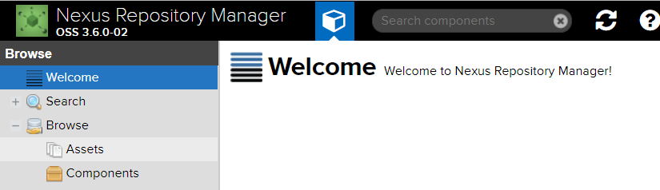
   
 
   
   ## 用户和角色
   
   使用默认的管理员admin/admin123登录，进入管理界面：
      
   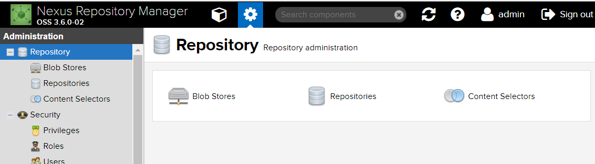
      
   可以点击上面的“设置”图标，在“设置”里可以添加用户、角色，对接LDAP等的设置。
   
   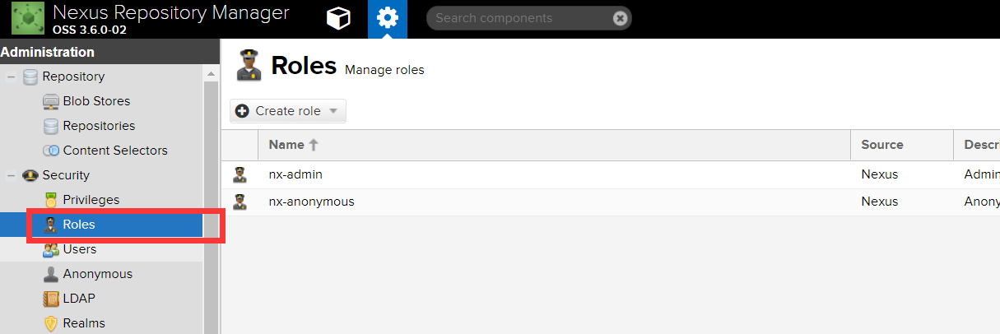
   
   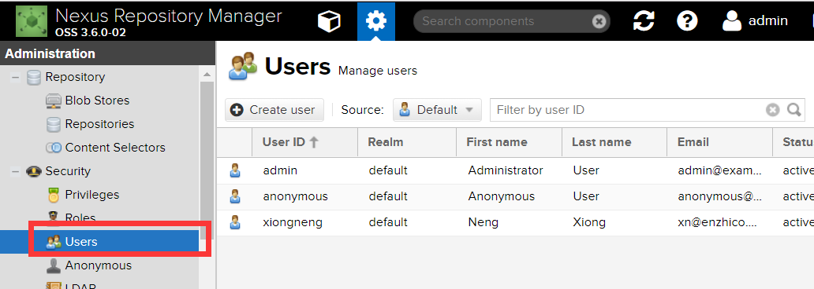
   
   
   ## 仓库
   
   最核心的是仓库管理
   
   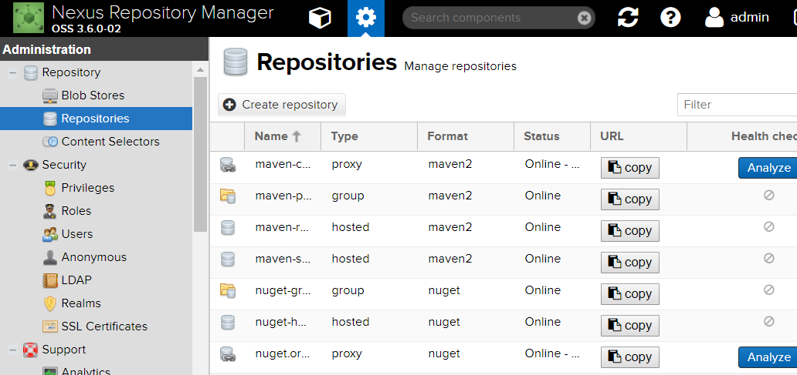
   
   
   默认的这几个仓库解释一下：
   
   * maven-central：maven中央库，默认从`https://repo.maven.apache.org/maven2/`拉取jar
   * maven-releases：私库发行版jar，初次安装请将Deployment policy设置为Allow redeploy
   * maven-snapshots：私库快照（调试版本）jar
   * maven-public：仓库分组，把上面三个仓库组合在一起对外提供服务，在本地maven基础配置settings.xml中使用。
   * Nexus默认的仓库类型有以下四种：
   
   * group(仓库组类型)：又叫组仓库，用于方便开发人员自己设定的仓库；
   * hosted(宿主类型)：内部项目的发布仓库（内部开发人员，发布上去存放的仓库）；
   * proxy(代理类型)：从远程中央仓库中寻找数据的仓库（可以点击对应的仓库的Configuration页签下Remote Storage属性的值即被代理的远程仓库的路径）；
   * virtual(虚拟类型)：虚拟仓库（这个基本用不到，重点关注上面三个仓库的使用）；
   * Policy(策略): 表示该仓库为发布(Release)版本仓库还是快照(Snapshot)版本仓库；
   
由于访问中央仓库有时候会比较慢，这里我添加一个阿里云的代理仓库，然后优先级放到默认中央库之前,， 阿里云的maven仓库url为`http://maven.aliyun.com/nexus/content/groups/public`
   
   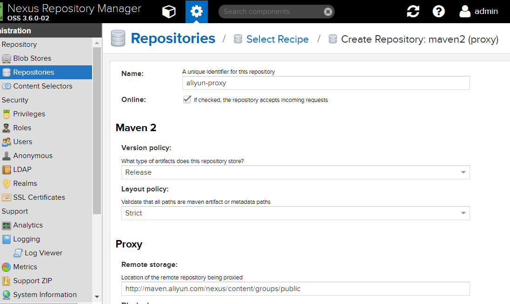
   
    
然后再public组里面讲这个aliyun-proxy仓库加入，排在maven-central之前即可。
      
   
 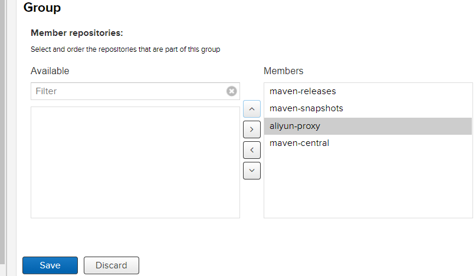
   
   ## 阿里云public库不完整
   
   由于阿里云public的这个库不完整，有些jar都没有，所以我又加了阿里云香港的仓库，日本的仓库，阿里云中央库：为了安全我又加了一个nexus官方的库：
   
       阿里云中央仓库地址
       http://maven.aliyun.com/nexus/content/repositories/central/
       阿里云香港仓库地址
       http://maven.aliyun.com/nexus/content/repositories/hongkong-nexus/
       阿里云日本仓库
       http://maven.aliyun.com/nexus/content/repositories/jcenter/
       nexus-仓库地址
       https://repository.sonatype.org/content/groups/forge/

   
   好了，现在很完美了。
   
   
   再把它们全部加到public私有库的group成员里去：
   
   
  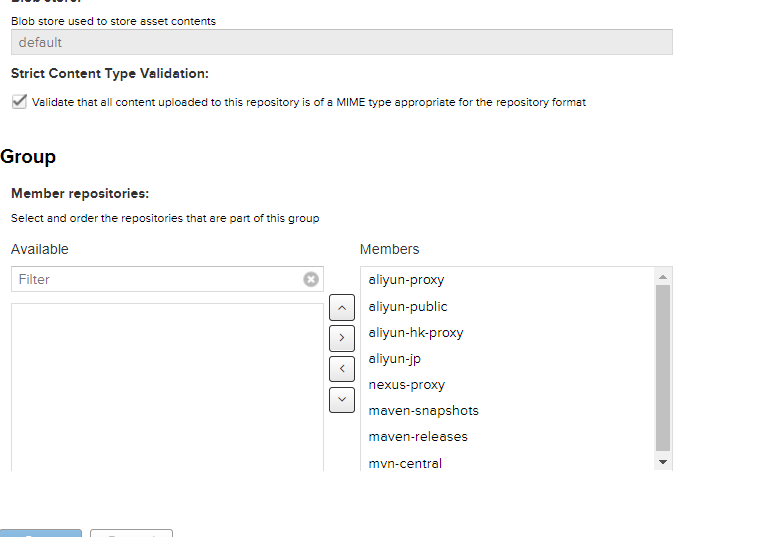
   
   
   ## Nexus仓库分类的概念
   
   1）Maven可直接从宿主仓库下载构件,也可以从代理仓库下载构件,而代理仓库间接的从远程仓库下载并缓存构件
   
   
   2）为了方便,Maven可以从仓库组下载构件,而仓库组并没有时间的内容(下图中用虚线表示,它会转向包含的宿主仓库或者代理仓库获得实际构件的内容)
   
   
   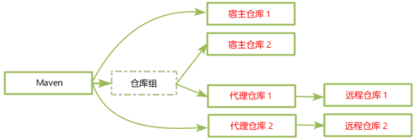
   
   
   ## Nexus的调度任务
   
   默认安装好之后是没有索引和jar文件的，因为你要自己定义任务去执行。
   
   Nexus提供了一系列可配置的调度任务来方便用户管理系统。用户可以设定这些任务运行的方式，例如每天、每周等。调度任务会在适当的时候在后台运行。
   
   要建立一个调度任务，单击左边导航菜单中的Tasks，点击Create Task，然后选择一个任务类型。
   
   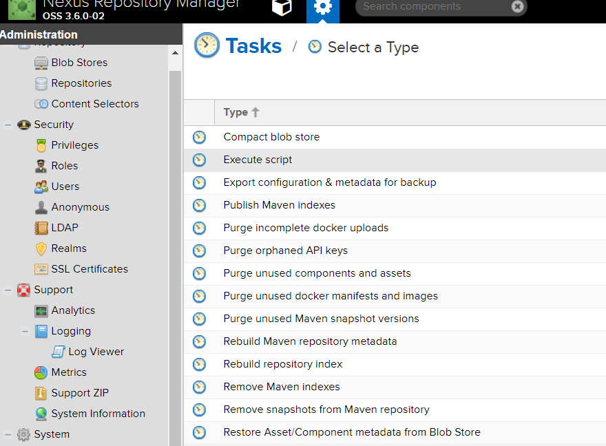
   
   
   
 以下几种常用类型的调度任务：
 
 Execute script：执行自定义脚本
 Purge开头：清理一些不使用的资源。
 Rebuild repository index：为仓库重新编纂索引，从远仓库下载最新的索引。
 Rebuild Maven repository metadata：基于仓库内容重新创建仓库元数据文件，同时重新创建每个文件的校验和md5与sha1。
 Remove snapshots from Maven repository：把快照删了，这个是在稳定版发布后清除
 比如我新建一个重构索引的任务，然后选择aliyun仓库，让它把远程索引取下来，手动执行。不过最好别这样做，因为需要很大的硬盘空间。
 
 最好是让它自己去维护，请求一个依赖的时候如果私服没有会自动去远仓库取的。  
 
 
 
 ## Blob Stores
 
 文件存储的地方，创建一个目录的话，对应文件系统的一个目录，可供仓库上传文件使用，如图所示：
 
 
 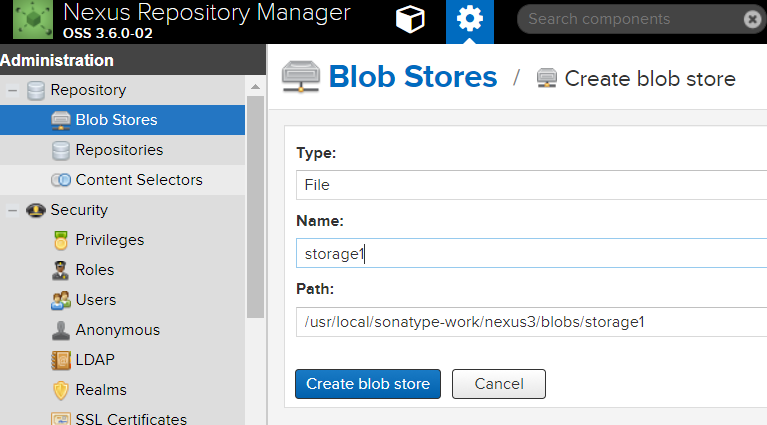
 
 
 ## 本地Maven使用私服
 
 安装和配置好之后，在开发中如何使用呢。可在maven的默认配置settings.xml中修改如下：
 
     <servers>
        <server>
             <id>releases</id>
             <username>admin</username>
             <password>admin123</password>
        </server>
        <server>
             <id>snapshots</id>
             <username>admin</username>
             <password>admin123</password>
        </server>
     </servers>
     
     <mirrors>
      
         <mirror>
            <id>slbMaven</id>
     	   <name>slb maven repo</name>
           <url>http://10.7.10.220/repository/maven-public/</url>
           <mirrorOf>central</mirrorOf>
         </mirror>
     
       </mirrors>
   
   
 如果要发布自己的jar到私服，就需要修改工程的pom.xml，添加如下内容，否则什么都不用做：
 
      <distributionManagement>
             <repository>
                 <id>releases</id>
                 <name>Releases</name>
                 <url>http://10.7.10.220/repository/maven-releases/</url>
             </repository>
             <snapshotRepository>
                 <id>snapshots</id>
                 <name>Snapshot</name>
                 <url>http://10.7.10.220/repository/maven-snapshots/</url>
             </snapshotRepository>
     </distributionManagement>
 
 
 **注意**:
 _上面的repository的id值一定要跟settings.xml文件中配置的server一致。_
 
 
 ## 上传jar/war到私服上
 
 上传到Nexus上，使用 mvn deploy 即可，开发的时候请使用snapshot版本，也就是version的后缀必须是-SNAPSHOT。
 
 pom.xml应该有如下配置：
 
    <groupId>com.myjf</groupId>
    <artifactId>backend</artifactId>
    <version>1.0.0-SNAPSHOT</version>
    <packaging>war</packaging>
    <name>backend interface</name>
 
 
 执行打包上传本地项目包：
 
    mvn deploy
    
    
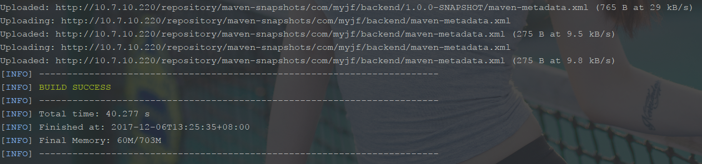
    
 
 成功后到nexus上看下应该是上传在snapshot仓库中：
 
 
 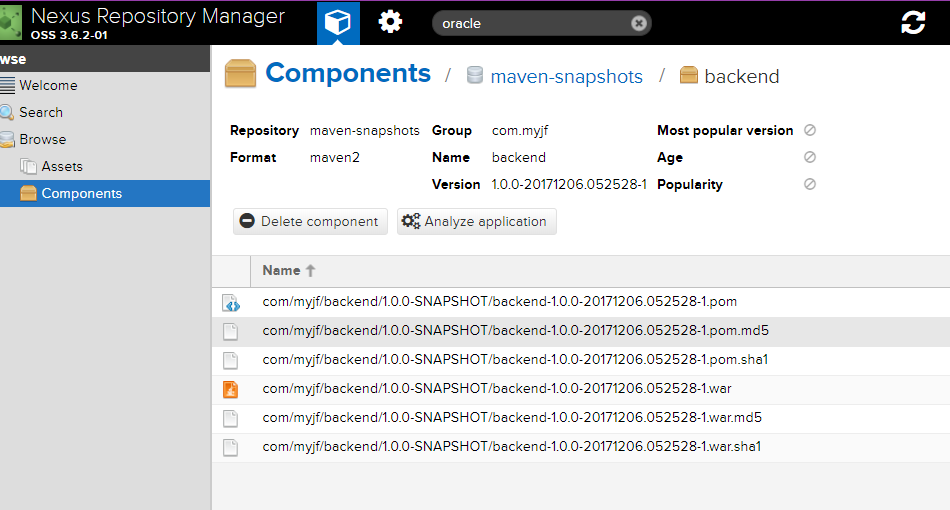
 
 
 上传第三方jar包：
 
    mvn deploy:deploy-file \
     -DgroupId=<group-id> \
     -DartifactId=<artifact-id> \
     -Dversion=<version> \
     -Dpackaging=<type-of-packaging> \
     -Dfile=<path-to-file> \
     -DrepositoryId=<server-id-settings.xml> \
     -Durl=<url-of-the-repository-to-deploy>
 
 
 -DrepositoryId的值即为在setttings.xml里面配置的server id。
 
 
 
   
[参考文章](http://www.cnblogs.com/kevingrace/p/6201984.html)